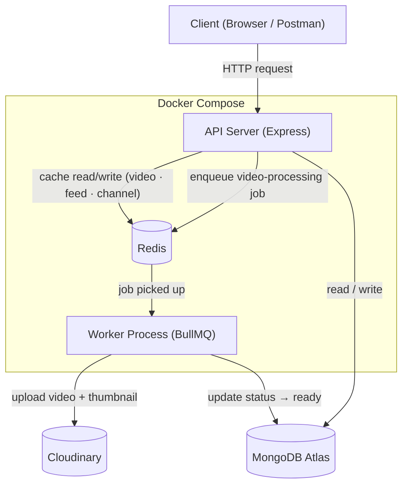

# 🎬 Velora

A backend for a modern video streaming platform — but the actual point of this project isn't the CRUD routes, it's what sits underneath them. Velora started as a standard Node/Express/MongoDB video-sharing API and was then deliberately re-architected for scale: real query-pattern indexes, a Redis caching layer with a correctness-aware invalidation strategy, an async job queue decoupling video processing from the request path, and a fully containerized deployment — each change driven by an audit of actual bottlenecks, and each one verified with real measurements, not assumptions.

---

## Architecture



**Why it's shaped this way:**
- The **API server** does the minimum needed to respond fast: auth, validation, cache lookups, and — for uploads — just creating a record and handing the slow work off to a queue.
- **Redis** does double duty: a cache in front of expensive MongoDB aggregations, and the backing store for the BullMQ job queue. Same infrastructure, two jobs.
- The **worker** is a separate, independently-scalable process (`docker compose up --scale worker=3`) that does the actual slow work — uploading to Cloudinary — completely decoupled from any HTTP request waiting on it.
- **MongoDB Atlas** and **Cloudinary** are external managed services; nothing about them needed containerizing.

---

## What was actually measured, not assumed

Every claim below comes from a real benchmark against a seeded 10,000-document dataset (scripts in [`scripts/benchmark/`](scripts/benchmark/)), not a guess:

| Change | Measurement | Result |
|---|---|---|
| **Compound indexes** on `Video` (`isPublished + createdAt`, `owner + isPublished + createdAt`) | Documents examined for the main feed query | **10,000 → 10** (1,000x fewer scanned documents; via `.explain("executionStats")`) |
| **Redis caching** (cache-aside, split shared/personalized data) | Time for a video-detail fetch: full MongoDB aggregation vs. Redis read | **32.2ms → 1.2ms (27x faster)** on a cache hit |
| **BullMQ job queue** for video upload | Time for the upload endpoint to respond | **~240ms, constant regardless of file size** — vs. the old synchronous design, where response time scaled directly with the Cloudinary upload duration |
| **Unique compound indexes** on `Like`/`Subscription` | — | Closes a real race condition: concurrent requests could previously create duplicate likes/subscriptions before either write finished |

**Also worth stating honestly**: a load test at 50 concurrent connections surfaced that `isLiked`/`isSubscribed` were being checked as two *sequential* MongoDB round-trips instead of in parallel — fixed via `Promise.all`, improving throughput 22–31%. A separate worker-scaling test (1 vs. 3 workers processing a batch of jobs) did **not** show a clean speedup, due to real-world variance hitting Cloudinary's API concurrently from a single dev machine — reported as-is rather than dressed up, because an indefensible number is worse than no number.

---

## Tech stack

- **Runtime / Framework** — Node.js, Express 5
- **Database** — MongoDB Atlas via Mongoose, with compound and unique indexes matching real query patterns
- **Caching** — Redis (`ioredis`), cache-aside pattern with TTL + explicit invalidation
- **Job queue** — BullMQ (Redis-backed), separate producer (API) and consumer (worker) processes
- **Media storage** — Cloudinary
- **Auth** — JWT (access + refresh tokens), bcrypt password hashing
- **Containerization** — Docker, Docker Compose (API + worker + Redis as independent, horizontally-scalable services)

---

## Features

- **Auth & accounts** — registration, login, JWT refresh, password change, avatar/cover image, watch history
- **Video** — async upload/processing pipeline, publish/unpublish (blocked until processing finishes), view tracking, search, sort, pagination
- **Comments, likes, subscriptions** — with race-condition-safe toggle logic backed by unique indexes
- **Playlists** — create, manage, add/remove videos
- **Creator dashboard** — aggregated stats (views, likes, subscribers, video count)
- **Text posts** — lightweight tweet-style posts with likes

---

## Getting started

### Prerequisites
- Node.js 20+
- Docker Desktop (for Redis, and for the containerized run option)
- A MongoDB Atlas connection string
- A Cloudinary account (cloud name, API key, API secret)

### Environment variables
Create a `.env` file in the project root:

```env
PORT=8000
MONGODB_URI=your_mongodb_atlas_uri
ACCESS_TOKEN_SECRET=your_secret
ACCESS_TOKEN_EXPIRY=1d
REFRESH_TOKEN_SECRET=your_secret
REFRESH_TOKEN_EXPIRY=10d
CLOUDINARY_CLOUD_NAME=your_cloud_name
CLOUDINARY_API_KEY=your_api_key
CLOUDINARY_API_SECRET=your_api_secret
CORS_ORIGIN=http://localhost:5173
REDIS_URL=redis://localhost:6379
```

### Option A — run locally (with Redis in Docker)

```bash
docker run -d --name velora-redis -p 6379:6379 redis:alpine
npm install
npm run dev      # API server, terminal 1
npm run worker   # background worker, terminal 2
```

### Option B — run everything in Docker

```bash
npm run docker:up     # builds and starts api + worker + redis together
npm run docker:down   # stops everything
```

Scale the worker independently, with zero code changes:
```bash
docker compose up -d --scale worker=3
```

---

## API reference

All 42 routes across every resource (auth, videos, comments, likes, subscriptions, playlists, tweets, dashboard) are documented in the included Postman collection: [`postman/Velora.postman_collection.json`](postman/Velora.postman_collection.json). Import it, run **Users → Login User** once, and every other request authenticates automatically via a collection variable.

---

## Project structure

```text
src/
├── controllers/     # request handlers
├── models/          # Mongoose schemas + indexes
├── routes/          # Express routers
├── middlewares/      # auth, rate limiting, error handling, uploads
├── queues/          # BullMQ queue + Redis connection (producer side)
├── workers/         # BullMQ worker (consumer side, separate process)
├── db/              # MongoDB + Redis connections
└── utils/           # ApiError, ApiResponse, asyncHandler, cache helpers, Cloudinary

scripts/
├── benchmark/       # seed, cleanup, and benchmark scripts used to produce the numbers above
└── generate-postman-collection.mjs

Dockerfile
docker-compose.yml
```

---

## Known limitations / what's next

- **No automated test suite yet** — everything so far has been verified through live manual testing and load testing (see the benchmark scripts). Adding Jest/Supertest coverage for the auth flow, the video pipeline, and the race-condition fixes is the next planned step.
- **No CI pipeline** — tests would need to exist first.
- **Adaptive bitrate streaming (HLS)** — videos are currently stored as single Cloudinary files rather than transcoded into multiple renditions.
- **Session/user lookup isn't cached** — `verifyJWT` does a MongoDB lookup on every authenticated request; the load test in this README's benchmark table surfaced this as the next real bottleneck.

---

## Author

Ved Ambulkar
